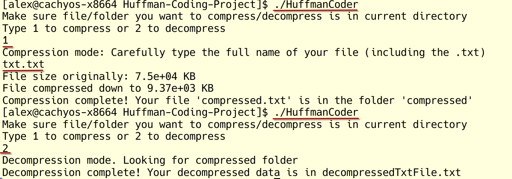

# Huffman-Coding-Project

This project uses Huffman Coding to compress and decompress **ASCII text files**. This does not work
with UTF-8 text files or anything else, just ASCII text files. It works by getting each char in
an ASCII file (1 byte) and then uses the Huffman Coding algorithm to make binary codes for each char. 
A new file is made where each character is replaced by a binary code. Then, the decompressor reads the
binary codes and uses them to traverse the Huffman tree. 0 goes to the left child, 1 goes to the right.
Once a leaf node is reached then we have a char, so we append that to a new file and continue this 
until we translate all codes into their respective chars.

## How to run
1. Download/Git clone the repository and enter the folder you just downloaded (should be called huffman-coding-project or something similar).

2. Then open the terminal in the folder. In the terminal type
```
make
```
and then
```
./HuffmanCoder
```
The terminal output from the program will explain the rest. Just make sure you have a .txt file ready
in the same folder as the executable. You can use any .txt file you want so long as there are only
ASCII chars in it.

For example, if you have a text file named text.txt in the same directory as the executable,
then after running `./HuffmanCoder` type `1` and then `text.txt` which compresses the file.
Then simply type `./HuffmanCoder` again and type `2` to decompress the file. Your decompressed
file will be in a new text file called `decompressedTxtFile.txt`.

## Example below (user input underlined in red)



## How to run built in tests
1. Go into the tests directory then type
```
make
```

2. Then type
```
./TestEncodeDecode
``` 
and all 12 text files will be tested. You can see what they decompress to in `tests/textDecompressed`
and their respective text file number. Ex. txt1.txt's decompressed result will be under folder 1
